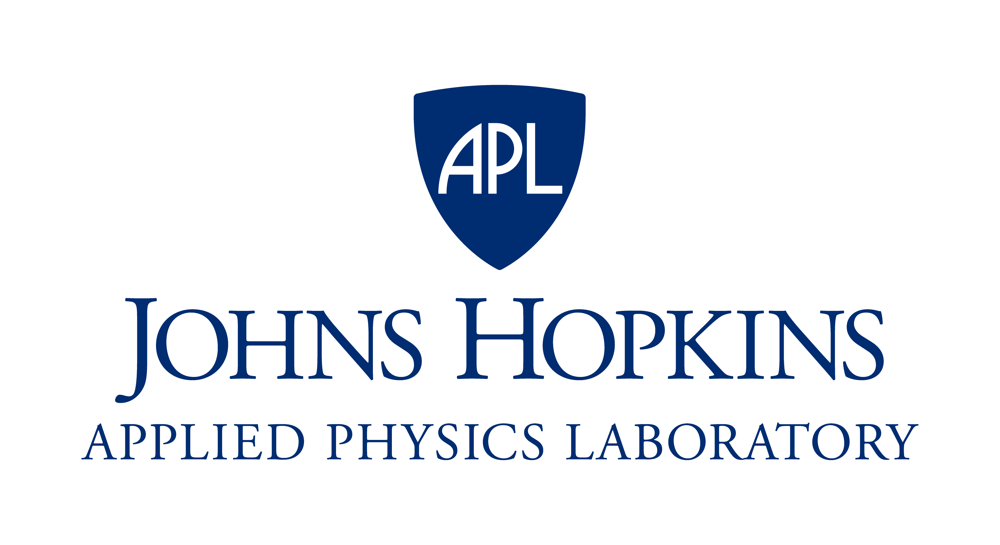

# Humans in an Autonomous and Robotic World

## Exploring and Enabling Human-Machine Partnerships for Sustained Deep-Space Presence including Moon and Mars

**Workshop Dates:**  December 8-9, 2025

**Venue:** Johns Hopkins University Bloomberg Center, 555 Pennsylvania Ave., Washington DC

**Room:** 

## Description

Through the Artemis program, astronauts will return to the Moon in 2028, supporting the American goal of
developing a sustained presence and a thriving lunar economy and continuing onto Mars.
This will thrust humans into a machine world of diverse autonomous systems working in remote and demanding
environment to achieve science, exploration and commercial goals within a complex infrastructure architecture.
There is a critical need for space stakeholders to develop in this envisioned future of operations in a human,
autonomous and robotic ecosystem. A more human-centric and integrated perspective to robotic teaming will
ensure maximal astronaut safety and optimize performance for assured, robust, and faster operations.

## Objective

The workshop objective is to develop a strategic, collaborative roadmap for assured, integrated
human-machine space operations, multi-stakeholder collaborations and consortium, and a technology and
policy research/analysis agenda to accelerate a sustainable human presence in space.

## Registration

Registration is by invitation only -- a link will be provided

## Agenda Overview

### Day 1 (Dec 8, 2025)

| Time        | Event                                                     |
|:------------|:----------------------------------------------------------|
| 09:00       | **Introduction and Welcome**                              |
|             | **Panel 1: Civil Space Perspective**                      |
|             | **Coffee Break**                                          |
|             | **Panel 2: National Security Space Perspective**          |
|             | **Lunch**                                                 |
|             | **Panel 3: "New" Space Perspective**                      |
|             | **Coffee Break**                                          |
|             | **Panel 4: Research and Analysis Stakeholder Perspective** |

### Day 2 (Dec 9, 2025)

| Time        | Event                                                     |
|:------------|:----------------------------------------------------------|
| 09:00       | **Keynote and Discussion**                                |
|             | **Panel 5: Astronaut Performance through Assured Health** |
|             | **Coffee Break**                                          |
|             | **Panel 6: Human-Machine Operations and Integration**     |
|             | **Lunch**                                                 |
|             | **Panel 7: Astronaut Perspectives on HMT Operations**     |
|             | **Coffee Break**                                          |
|             | **Panel 8: Developing a Consortium**                      |
|             | - Facilitated small group discussions                     |
|             | - Report outs - the way forward                           |

## Agenda Details

### Introduction and Welcome
- Ray Jayawardhana, Provost, Johns Hopkins University
- Jason Kalirai, Mission Area Executive, APL Space Sector

### Panel 1: Civil Space Perspective

**Moderator:**
- Phil Larson, Chief of Strategy and Engagement, APL Space Sector

**Panelists:**
- Sarah Brothers, Director, Commercial Remote Sensing Regulatory Affairs Division, Office of Space Commerce, U.S. Dept. of Commerce
- Niki Werkeiser, Director for Technology Maturation, NASA STMD
- Joel Graham, Associate Administrator, Office of Legislative and Intergovernmental Affairs, NASA

### Panel 2: National Security Space Perspective

**Moderator:**
- Emma Rainey, Engineering Program Manager, APL Space Sector

**Panelists:**
- Charles Anderson, Deputy Mission Area Executive, APL Space Sector
- Ernest B. Webb, Division Chief, Medical Operations and Standards, Office of the Air and Space Force Surgeon General
- James Curbo, Chief Scientist, Cyberoperations, APL

### Panel 3: "New" Space Perspective

**Moderator:**
- TBD

**Panelists:**
- Ruth Stillwell, Executive Director, Aerospace Policy Solutions, LLC
- Janna Lewis, Senior Vice President of Policy, Astroscale U.S.
- Ben Bussey, Chief Scientist, Intuitive Machines

### Panel 4: Research and Analysis Stakeholder Perspective

**Moderator:**
- David Akin, Professor, Dept. of Aerospace Engineering, University of Maryland

**Panelists:**
- James Bellingham, Professor and Executive Director, Institute for Assured Autonomy, JHU
- Christine Fox, Senior Fellow, APL
- Robert Braun, Head, APL Space Sector, and Professor, Dept. of Mechanical Engineering, JHU
- David Koelle, Director of Engineering, Human-Centered AI, Charles River Analytics

### Keynote and Discussion
- Brian Weeden, Director of Civil and Commercial Policy, Center for Space Policy and Strategy

### Panel 5: Astronaut Performance through Assured Health

**Moderator:**
- Mark Shelhamer, Professor, School of Medicine, JHU

**Panelists:**
- Dan Buckland, Associate Professor, Emergency Medicine, University of Wisconsin-Madison
- Dana Levin, Medical Director and Chief Flight Surgeon, Vast Space
- Dawn Kernagis, Director of Scientific Research, DEEP

### Panel 6: Human-Machine Operations and Integration

**Moderator:**
- Peter Kazanzides, Research Professor, Computer Science, JHU

**Panelists:**
- Shirley Dyke, Professor, School of Mechanical Engineering, Purdue University
- David Handelman, Senior Staff Roboticist and Project Manager, Research and Exploratory Development Department, APL
- Colleen Hartman, Director of Physics, Aeronautics and Space Sciences, National Academies of Sciences, Engineering, and Medicine
- TBD

### Panel 7: Astronaut Perspectives on HMT Operations

**Moderator:**
- TBD

**Panelists:**
- Jim Riley, Astronaut
- TBD

### Panel 8: Developing a Consortium: Integrated Human Machine Partnerships for a Sustained Presence, Moon to Mars

**Moderator:**
- TBD

**Panelists:**
- James Bellingham, Professor and Executive Director, Institute for Assured Autonomy, JHU
- Janna Lewis, Senior Vice President of Policy, Astroscale U.S.
- Colleen Hartman, Director of Physics, Aeronautics and Space Sciences, National Academies of Sciences, Engineering, and Medicine

## Organizers

| Mark Shelhamer    |  Amy Haufler, Karl Hibbitts    | Peter Kazanzides    |
|:-----------------:|:------------------------------:|:-------------------:|
|  |  |  |

## Support

This workshop is made possible by funding from the Johns Hopkins Nexus Award program.
