# Humans in an Autonomous and Robotic World

## Exploring and Enabling Human-Machine Partnerships for Sustained Deep-Space Presence including Moon and Mars

[Back to Agenda](../Workshop-Dec-2025.html)

## Panelists, Moderators and Organizers

### Charles Anderson (Panel 2)
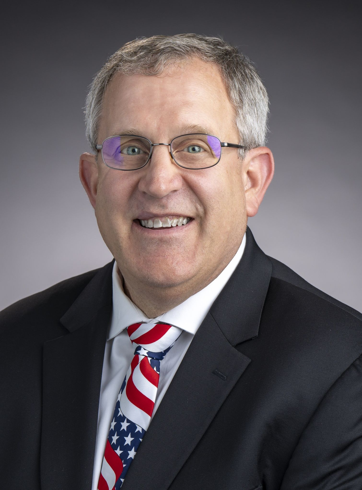
Charles T. "Chuck" Anderson is the Deputy Mission Area Executive in the Space Exploration Sector's National Security Space Mission Area at the JHU Applied Physics Laboratory (APL). A recognized expert in U.S. Space Force, Air Force, joint space operations, communications, missile defense, and space situational awareness, he joined APL in 2005 after a 21-year Army career as a Signal and Space Operations Officer and has since held numerous leadership roles. He holds a Master of Military Arts and Science in space operations from the U.S. Army Command and General Staff College and a B.S. in computer studies from the University of Maryland Global Campus.
  

### Robert Braun (Panel 4)

Dr. Robert D. Braun is head of the Space Exploration Sector at the Johns Hopkins Applied Physics Laboratory with responsibilities that span all civil and national security space activities at the Lab. He is also a Professor in the Department of Mechanical Engineering at Johns Hopkins University. He has contributed to the formulation, development, test, and operation of multiple space flight missions. He previously worked at NASA, Georgia Tech, the University of Colorado Boulder, and the Jet Propulsion Laboratory.
 

### Dan Buckland (Panel 5)
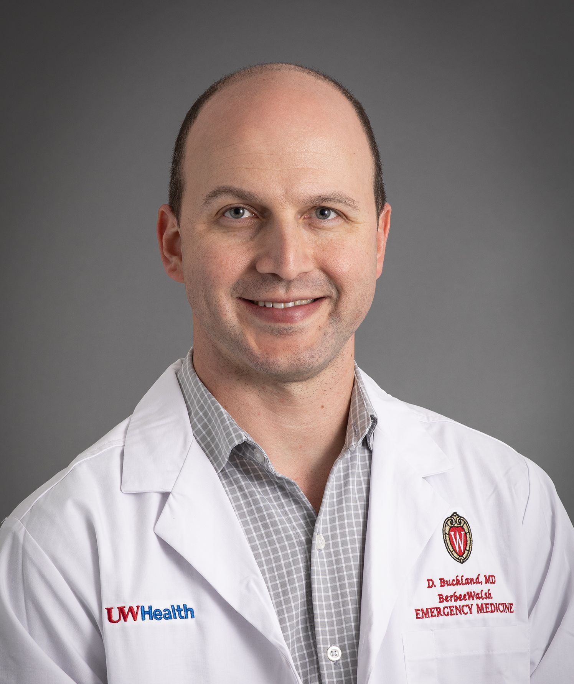
Dr. Daniel Buckland MD PhD is an Associate Professor of Emergency Medicine and Mechanical Engineering at the University of Wisconsin - Madison. He was the Deputy Human System Risk Manager for NASA until August 2025 with a portfolio that included determining the risk mitigation potential of automation in human exploration spaceflight.  His current research focuses on the development of automation within safety critical systems, including healthcare and human spaceflight.
 

### James Curbo (Panel 2)
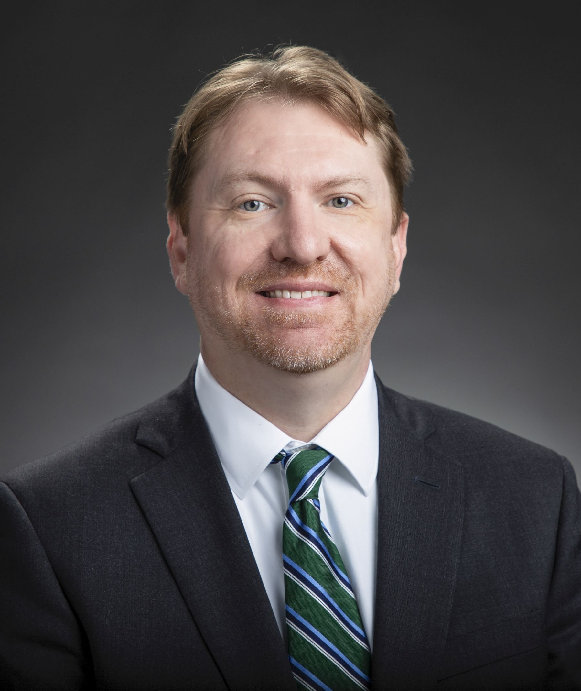
James Curbo serves as the Chief Scientist of the Constrained Cyber Solutions Group at the Johns Hopkins University Applied Physics Laboratory. His work focuses on cybersecurity and cyber operations for space systems. He is currently pursuing a doctorate at the Johns Hopkins University Whiting School of Engineering, where his research is focused on cyber-resilient spacecraft design and implementation.
 
 

### Shirley Dyke (Panel 6)
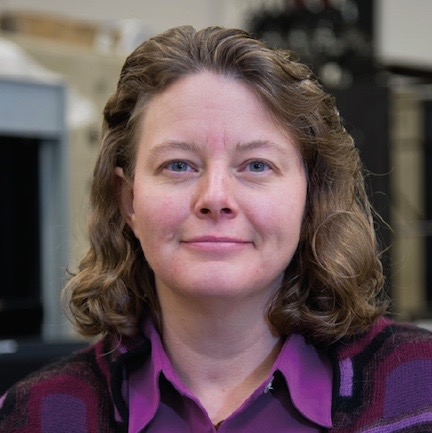
Professor Shirley J. Dyke is the Coates Professor of Innovation in Mechanical Engineering at Purdue University, where she holds a joint appointment in both Mechanical Engineering, and Civil Engineering. She currently serves as the Director of the NASA-funded Resilient ExtraTerrestrial Habitat Institute (RETHi) and the Director of Purdue's Intelligent Infrastructure Systems Lab.  She also serves on the 2024-2026 AIAA Lunar Surface Exploration and Development Task Force.
 

### Christine Fox (Panel 4)
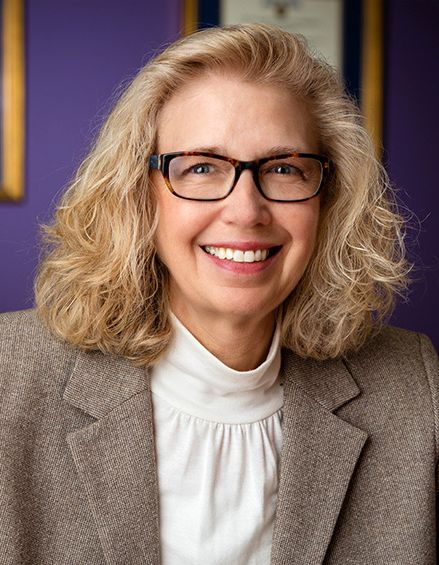
The Honorable Christine Fox is a Senior Fellow at the Johns Hopkins University Applied Physics Laboratory. She also serves on governance and advisory boards including the Strategic Competitive Studies Project, the Atlantic Council, Palantir Technologies, Muon Space, DEFCON AI, and Brown Advisory. Previously, she served as Director of Cost Assessment and Program Evaluation (CAPE) from 2009-2013 and as (acting) Deputy Secretary of Defense from 2013-2014. Ms. Fox holds a bachelor and master of science degree in applied mathematics from George Mason University.
 

### David Handelman (Panel 6)
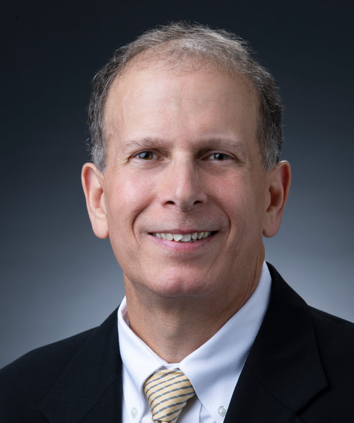
David Handelman is a Sr. Robotics Researcher in the Research and Exploratory Development Department at the Johns Hopkins Applied Physics Laboratory. He received a B.S. in Aerospace Engineering from the University of Virginia, and a Ph.D. in Mechanical and Aerospace Engineering from Princeton University. His areas of interest include robotics, autonomy, AI/ML, dexterous manipulation and bio-inspired human-machine teaming.
 
 

### Colleen Hartman (Panel 6 Moderator, Panel 8)
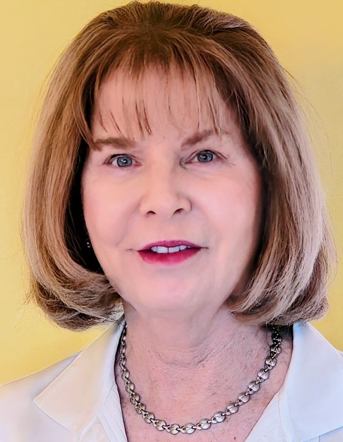
Professor Colleen N. Hartman, a physicist and Research Professor at George Washington University, previously led the National Academies' portfolios in aeronautics, astronomy, physics, and space science. She served in senior roles at NASA and the White House, contributing to missions ranging from sounding rockets and balloons to Hubble, JWST, and outer-planet exploration, and brings both technical depth and policy experience to national space programs.
 
 

### Peter Kazanzides (Organizer, Panel 6 Moderator)
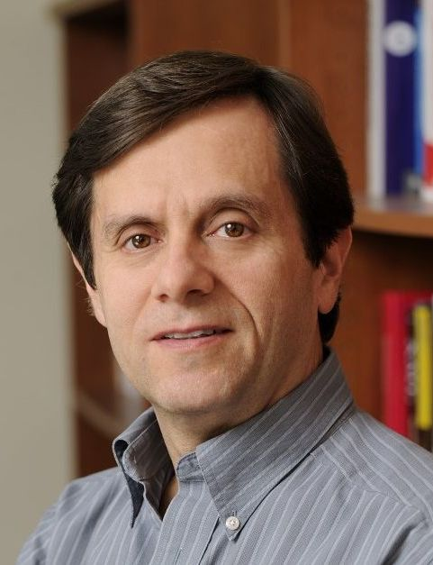
Peter Kazanzides is a Research Professor of Computer Science at Johns Hopkins University (JHU) and has worked in medical robotics for more than 35 years. Previously, he was co-founder and Director of Robotics and Software at Integrated Surgical Systems, developer of the Robodoc Surgical System. Robodoc completed its first-in-human hip replacement surgery in 1992 and was subsequently used for more than 20,000 hip and knee replacement surgeries. More recently, he led a JHU research effort in support of the NASA Restore-L and OSAM-1 missions.
 

### Dawn Kernagis (Panel 5)
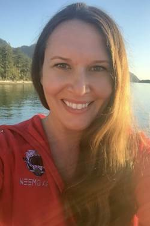
Dawn Kernagis is Director of Scientific Research at DEEP, an engineering and research organization evolving how humans live and work underwater. She was Vice Chair for Research at the University of North Carolina - Chapel Hill prior to joining DEEP. Her research has focused on developing neuroprotective strategies for individuals who will be exposed to high physiological stress. Prior to joining UNC, she was an IHMC Research Scientist. She completed her Ph.D. and postdoctoral training at Duke University, where she was an American Heart Association Postdoctoral Fellow and funded by the Office of Naval Research (ONR) to identify mechanisms and potential therapeutic targets for acute brain injury. She was selected as a crew member of the NASA NEEMO XXI undersea mission (2016) and was inducted as a member of the Women Divers Hall of Fame and as a Fellow of the Explorers Club.

### David Koelle (Panel 4)
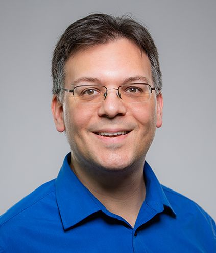
David Koelle is Director of Engineering and Principal Software Engineer at Charles River Analytics. In his work on collaborative autonomy for multi-robot systems for clients including DARPA, NASA, and the Air Force, he focuses on autonomous platforms that work with each other and with human operators and workers to achieve objectives in the face of expeditionary environments, intermittent or denied communications, dynamic adversary responses, and changing performance of the platforms.
 

### Dana Levin (Panel 5)
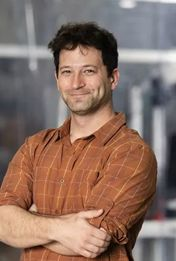
Dr. Dana Levin is board certified in Emergency Medicine and Aerospace Medicine and has more than a decade of experience caring for humans on all 7 continents, beneath the sea, and in space. He currently serves as the Director of Space Medicine for Vast Space and maintains an active clinical practice in Emergency Medicine with faculty appointments with UC Irvine, the Massachusetts General Hospital, and UCLA. In addition to experience in rural hospitals and major medical centers, he has extensive field experience in high altitude, underwater, polar, and other austere environments.
 

### Michael Lopez-Alegria (Panel 7)

Michael Lopez-Alegria serves as Chief Astronaut for Axiom Space. As a NASA astronaut, he flew to space three times on the Space Shuttle and once on the Russian Soyuz, commanding International Space Station Expedition 14. More recently, he led the first all private astronaut mission to the ISS in 2022, and returned to low Earth orbit for the sixth time last year on Axiom Mission 3.
 
 
 

### Steve McGuire (Panel 6)
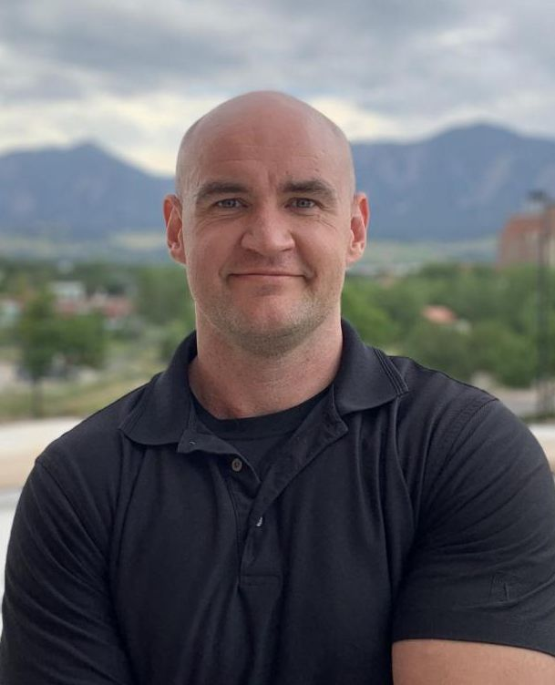
Dr. Steve McGuire is an assistant professor within the Department of Electrical and Computer Engineering department at the University of
California Santa Cruz after a career in the Marine Corps where he served as a helicopter pilot. Building on his work in human-robot interaction as a NASA Space
Technology Research fellow, his Human-Aware Robotic Exploration group investigates modern challenges in field robotics involving human
interaction, with a recent 3rd place win as part of a DARPA Subterranean Challenge team. His research focuses on improving organic capabilities
of field robots and teaching robots to learn about their human teammates.
 

### Gioia Rau (Panel 1)
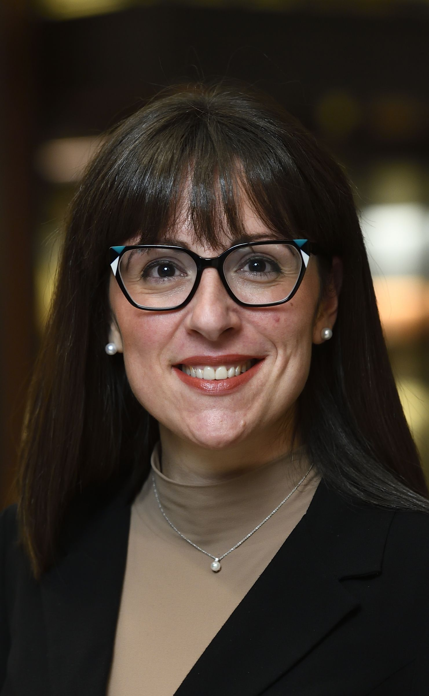
Dr. Gioia Rau is a space leader whose work bridges government, philanthropy, academia, and industry. She currently serves as a Program Director at NSF and holds a senior role at Schmidt Sciences. Her portfolio integrates cross-sector initiatives in space, astrophysics, and AI. Dr. Rau writes and advises internationally, including a recent Nature Comment on scientific leadership in space exploration.
 
 
 

### Federico Rossi (Panel 4)
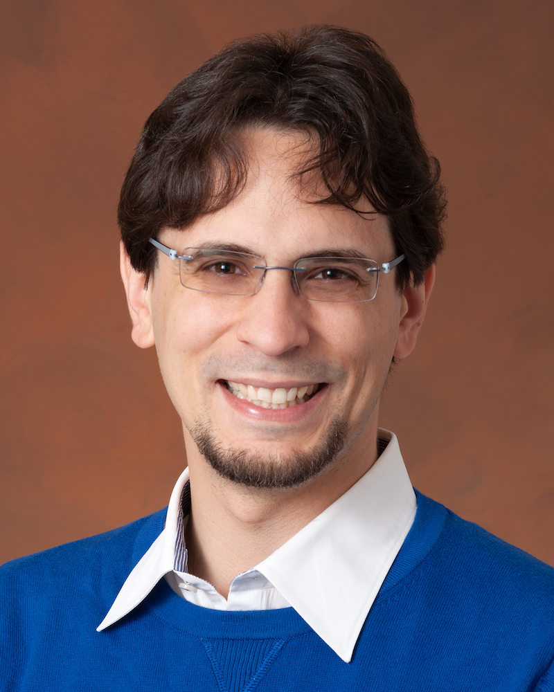
Dr. Federico Rossi is a Robotics Technologist with the Multi-Agent Robotics Group within the Robotics section of NASA's Jet Propulsion Laboratory. He received a Ph.D. in Aeronautics and Astronautics at Stanford University in 2018. Federico leads the multi-agent autonomy team for NASA's Coordinated Autonomous Distributed Robotics Explorers (CADRE) mission, a team of three autonomous rovers designed for Lunar surface and sub-surface exploration. Federico's research focuses on decision-making under uncertainty in robotic systems and operations of autonomous agents. At JPL, he has developed autonomy technologies for cooperative robotic exploration, joint orbit and observation optimization for exploration of small bodies, and under-ice navigation in Antarctica.
 

### Mark Shelhamer (Organizer, Panel 5 Moderator)

Mark Shelhamer has an BS and MS in electrical engineering and a doctoral degree in Biomedical Engineering. His research is in the area of sensorimotor function, which includes experiments on ISS astronauts and crews of commercial orbital space flights. He also has a research program devoted to the multi-system and cross-disciplinary interactions that contribute to personal and mission resilience in spaceflight. From 2013 to 2016 he served as Chief Scientist for the NASA Human Research Program. In that role, he oversaw NASA's research portfolio for maintaining health and performance in long-duration spaceflight.
 

### Ruth Stilwell (Panel 3)
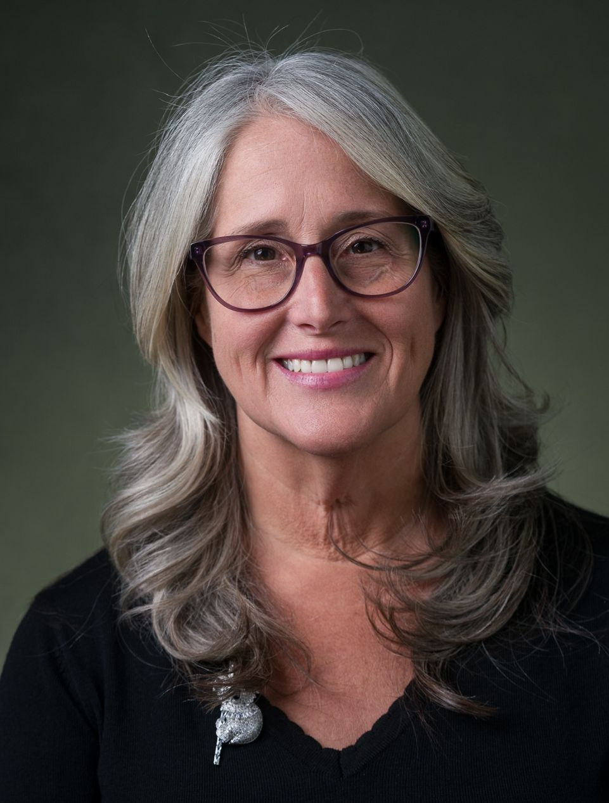
Dr. Ruth Stilwell is the Executive Director of Aerospace Policy Solutions LLC, specializing in space and aviation policy with a particular focus on the integration of emerging technologies.  She brings 10 years of research experience in space traffic management and 25 years of operational experience in air traffic management, including 5 years as industry expert on the ICAO Air Navigation Commission at the beginning of its work on the development of standards and recommended practices for unmanned and autonomous aircraft.
 

### Dan Tani (Panel 7)
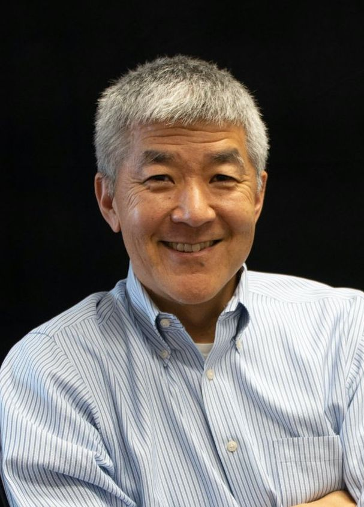
Dan Tani is a former NASA astronaut who spent 132 days in space over 2 missions, including living aboard the ISS for 4 months.  In addition to his time at NASA, Tani has worked in the commercial space sector, the non-profit sector and even taught high school.  He attended MIT and performed his Master's research in the Man-Machine Laboratory (probably renamed at this point!)
 
 
 

### Julie Townsend (Panel 6)
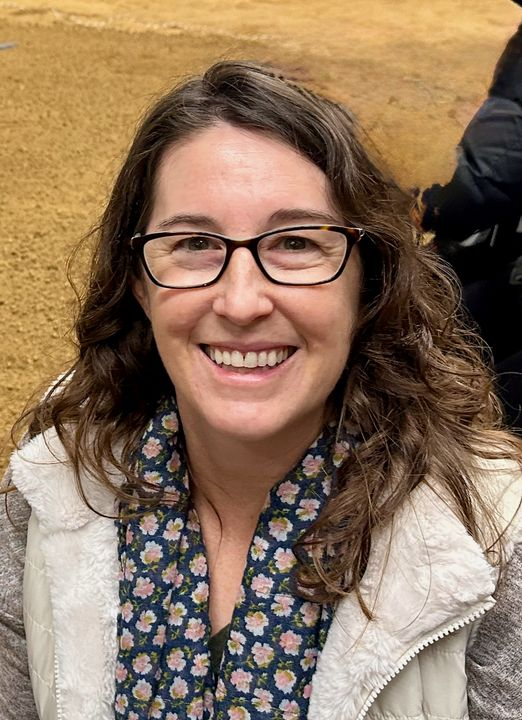
Julie Townsend is Assistant Manager for Robotic Mobility and Manipulation at the Jet Propulsion Laboratory. Julie has extensive hands-on experience interacting with fielded autonomous robots, with roles including Rover Planner for the Spirit and Opportunity Rovers, Test Lead for the ATHLETE lunar utility robot prototype, and Validation Lead and Operations Architect for the Perseverance Rover robotic Sampling and Caching Subsystem.
 
 

### Emmanuel Urquieta (Panel 5)
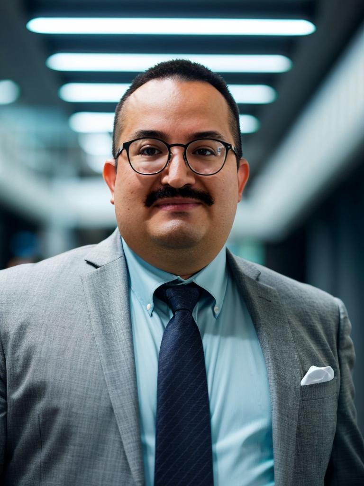
Emmanuel Urquieta, M.D., M.S., FAsMA, is the Vice Chair for Aerospace Medicine at the University of Central Florida (UCF) - College of Medicine, and the founding director of the UCF Center for Aerospace and Extreme Environments Medicine. Before joining UCF,  Dr. Urquieta served as the Chief Medical Officer at the NASA-funded Translational Research Institute for Space Health. Dr. Urquieta holds a medical degree and specialty in emergency medicine from Anahuac University in Mexico City and an M.S. in aerospace medicine from Wright State University in Dayton, Ohio.
 

### Ernest B. Webb (Panel 2)
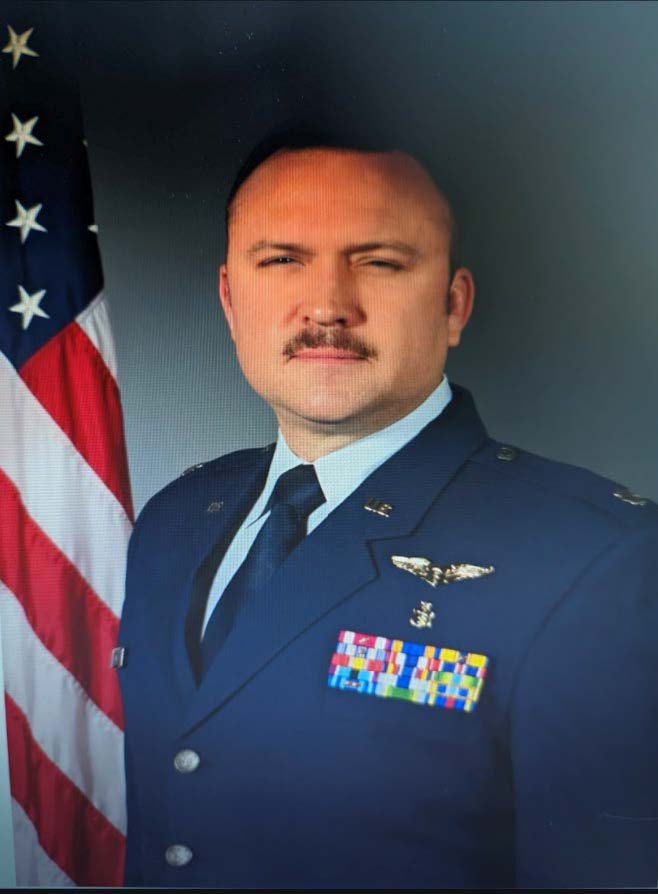
Lt Col (Dr.) Ernest B. Webb is the Division Chief for Medical Operations and Standards at Headquarters Air Force Office of the Surgeon General, Peterson SFB, Colorado. He leads strategic planning and policy development for the United States Space Force (USSF) medical operations and ensures alignment of medical standards with joint operational readiness.  Lt Col Webb's enduring mission is to align military medical standards with the demands of orbital and global combat environments and to strengthen readiness through innovative policy, resilient infrastructure, and mission-focused medical support.
 

### Brian Weeden (Keynote)

Dr. Brian Weeden is a director of civil and commercial policy for the Center for Space Policy and Strategy at The Aerospace Corporation, where he serves as a senior analyst and team leader on topics that cut across policy, technology, and economics. He specializes in the integration and advancement of technical, policy, legal, security, commercial, and international aspects of space activities. [Online bio.](https://csps.aerospace.org/experts/brian-weeden)
 
 

[Back to Agenda](../Workshop-Dec-2025.html)
